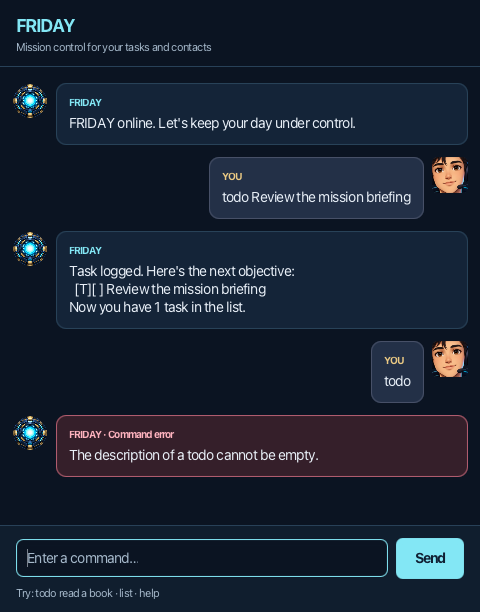

# FRIDAY

FRIDAY is your mission assistant for tasks and contacts: calm, capable, and occasionally dryly witty.

Start with the [user guide](docs/README.md#quick-start), browse the
[command reference](docs/README.md#command-reference), or read about
[FRIDAY's personality](docs/README.md#a-personality-friday-mission-assistant).

## AI declaration

AI assistance was used at AL-5 as declared for the course. Earlier work used Codex 5.4-mini
for greeting artwork, project instructions, task classes, and error handling, and Codex 5.4
for deletion and documentation. The existing declaration also records Codex 5.6 Sol Medium
assistance with code, READMEs, tests, Gradle, and agent instructions.

## Setting up in IntelliJ IDEA

Prerequisites: **JDK 25.0.3.fx-zulu** and an IntelliJ IDEA version that supports Java 25.
The committed Gradle wrapper downloads **Gradle 9.6.1**; no separate Gradle installation is needed.

1. Open this project's root directory and import it as a Gradle project using `build.gradle`.
2. Set **Project SDK** to **25.0.3.fx-zulu** and **Project language level** to **25**, without preview features.
3. Under **Settings > Build, Execution, Deployment > Build Tools > Gradle**, select the project's
   **Gradle wrapper** and set **Gradle JVM** to the same **25.0.3.fx-zulu** SDK. Reload the Gradle project.
4. Run the Gradle **application > run** task, or use the terminal commands below. The JavaFX entry point is
   `friday.Launcher` (which starts `friday.Main`); `src/main/java` remains the source root. Task data stays in `data/friday.txt`
   under the project root.

If an existing IntelliJ project does not import Gradle correctly, close it, back up `.idea` and
any `.iml` files, move those IDE configuration files aside, and reopen the root as a Gradle project.
This follows [scenario 2 of the course tutorial](https://se-education.org/guides/tutorials/gradle.html).
Do not delete your sources or `data` folder.

From the project root on macOS/Linux:

```bash
sdk use java 25.0.3.fx-zulu
./gradlew --version
./gradlew clean build
./gradlew --quiet --console=plain run
```

Use the chat window to enter `hello` and then `bye` to check input and shutdown. On Windows, select the same JDK using
`JAVA_HOME` and use `gradlew.bat` in place of `./gradlew` (or `.\gradlew.bat` in PowerShell).
The first invocation needs internet access to download the pinned Gradle distribution.

`build` compiles, runs the JUnit tests, and packages the application. Run `./gradlew test`
for JUnit alone; the report is `build/reports/tests/test/index.html`. Tests follow Gradle's
conventions under `src/test/java`, mirroring the production packages. Console regressions are
also JUnit tests: `friday.ConsoleUiRegressionTest` reads the cases in `test/ui-test-plan.md`.
Run `./gradlew test --tests friday.ConsoleUiRegressionTest` to execute those cases alone.

## Continuous integration

GitHub Actions runs [Java CI](.github/workflows/gradle.yml) on every push and pull request,
using Linux, macOS, and Windows with Zulu **JDK 25.0.3 with JavaFX**. The workflow validates
the Gradle wrapper, then runs `./gradlew --no-daemon --console=plain check`, which compiles
the project and runs the JUnit suite, including the console UI regression cases. Native GUI acceptance
tests are opt-in local checks because they require a graphical desktop.
The workflow is adapted from the [SE-EDU Duke template](https://github.com/se-edu/duke/blob/full-template/.github/workflows/gradle.yml).

Open the repository's **Actions** tab and select
**Java CI** to inspect each platform's results and failed-step logs. Enable Actions if GitHub
prompts you to do so for the fork. If pushing over HTTPS with a classic PAT, the token needs
the `workflow` scope to update workflow files; do not put the PAT in the workflow or repository.

## Implementation record by level and tag

Each entry describes the work associated with the named level or tag. Verification notes describe
available evidence, not a claim that every historical tag was retested with the current suite.
Later improvements can supersede the behavior recorded at earlier milestones.

### Level-0: Initial chatbot

- **What we did:** Added the initial FRIDAY welcome, separators, and farewell in a Java entry point.
- **Verification:** The tagged source contains the startup and farewell output.

### Level-1: Interactive conversation

- **What we did:** Added an input loop, echo responses, and personality commands with greeting artwork.
- **Verification:** Recorded in the tagged implementation. A-Personality later replaces the greeting artwork
  with compact dialogue.

### Level-2: Store and list tasks

- **What we did:** Stored user-entered items in an array and added `list` with one-based numbering.
- **Verification:** The tagged implementation stores up to 100 items and displays the saved entries.

### Level-3: Shared early milestone

- **What we did:** The existing `Level-3` tag points to the same commit as `Level-2` (`4471270`).
  That snapshot contains item storage and listing; it does not yet implement completion tracking.
- **Verification:** Checked the tagged source. Completion tracking is present in the current application;
  this entry does not attribute it to the shared early snapshot.

### Level-4: Task types

- **What we did:** Introduced todos, deadlines, and events using task classes, inheritance, and polymorphism.
- **Verification:** Current parser and task-model tests cover task construction and type-specific behavior.

### Level-5: Error handling

- **What we did:** Added validation and exception handling for unknown commands, empty descriptions,
  missing fields, and invalid task selections.
- **Verification:** The [console test plan](test/ui-test-plan.md) records exact invalid-input responses;
  parser tests cover valid inputs, boundaries, and rejection cases.

### Level-6: Delete tasks

- **What we did:** Added `delete TASK_NUMBER`, removal feedback, and checks for missing or invalid numbers.
  Updated the user guide and error-handling regression cases.
- **Verification:** Task-list and console tests cover deletion, numbering, and unchanged state after errors.

### Level-7: Save and load

- **What we did:** Loaded tasks from `data/friday.txt` and saved after task changes. Preserved task types
  and completion status, created missing folders, and used temporary-file replacement for saves.
  Protected unreadable or malformed files from overwriting.
- **Verification:** Storage and console tests cover round trips, restarts, corrupt files, and failed saves.

### Level-8: Dates and times

- **What we did:** Used `LocalDateTime` for deadlines and events, added strict date/time parsing and
  readable output, rejected backwards event intervals, and added `on yyyy-MM-dd` filtering.
- **Verification:** Date and console tests cover invalid dates, time boundaries, persistence, and filtering
  with original task numbers.

### Level-9: Find tasks

- **What we did:** Added `find KEYWORD` using case-sensitive literal substring matching on descriptions.
  Kept original task numbers and included completed tasks.
- **Verification:** Parser, task-list, and console tests cover phrases, blank keywords, no matches,
  and searches that do not modify or save data.

### Level-10: JavaFX GUI

- **What we did:** Added FXML layouts, reusable dialogue components, Enter/Send submission, and the
  `friday.Launcher` entry point. Connected the GUI to the existing command engine.
- **Verification:** `FridayTest` covers the response API; console regressions cover the shared command behavior.
  Later desktop acceptance tests cover GUI interaction and resizing.

### A-MoreOOP-1: Separate responsibilities

- **What we did:** Extracted `Ui` for presentation. Subsequent increments extracted `TaskList` for task
  ownership and mutations, and `Parser` for command syntax, alongside the existing `Storage` layer.
- **Verification:** The `A-MoreOOP-1` tag marks the first UI extraction. Later parser and task-list tests
  verify validation, ownership, numbering, and unchanged persistence behavior.

### A-Packages: Organize application boundaries

- **What we did:** Grouped the application into `friday`, `friday.task`, `friday.parser`,
  `friday.storage`, and `friday.ui`; the contact extension later added `friday.contact`.
  Updated imports and package-qualified entry points.
- **Verification:** Gradle compiles the packaged sources. Tests now mirror production packages under
  `src/test/java`; production sources remain under `src/main/java`.

### A-Gradle: Standardize build and run

- **What we did:** Integrated the Duke Gradle support, pinned the wrapper distribution checksum,
  and configured Java compilation and application launch. Kept the project working directory for data files.
- **Verification:** Build and run commands are documented above. The current GUI launches through
  `friday.Launcher`; the original console entry point remains `friday.Friday`.

### A-JUnit: Automated regression coverage

- **What we did:** Added JUnit Jupiter and migrated standalone tests to Gradle's standard test layout.
  Used parameterized cases and `@TempDir` fixtures for parsing, task operations, dates, and storage.
  Later migrated the Markdown console regression runner to JUnit.
- **Verification:** `./gradlew test` runs the suite, including all console cases. Coverage prioritizes
  roughly the 50% highest-value methods; this is not a measured line-coverage claim.

### A-JavaDoc: Document APIs

- **What we did:** Documented public task and task-list APIs, parameters, return values, invalid selections,
  and collection-copy behavior, alongside existing class and method comments.
- **Verification:** Reviewed Javadoc coverage against the minimum requirement of header comments for
  at least half of non-private production classes and methods. Runtime behavior was unchanged.

### A-CodingStandard: Apply project conventions

- **What we did:** Applied SE-EDU Java conventions to names, layout, imports, and Javadoc. Added project
  skills for Java and Git conventions and required them in the agent instructions.
- **Verification:** Reviewed formatting and documentation and retained existing regression coverage.
  Merge resolutions preserved API documentation and both branches' changes.

### A-Jar: Packaging milestone

- **What we did:** Recorded the `A-Jar` tag at `343e305`. The tagged project includes Gradle's Java and
  application build configuration; the tagged commit itself updates the AI declaration.
- **Verification:** This record does not establish that a standalone executable JAR was built or tested.
  Use the documented Gradle launch command for the current GUI.

### A-Assertions: Document invariants

- **What we did:** Added Java assertions for task-count changes, event ordering, task-number index
  conversion, and storage-record integrity. Kept input validation and user-facing errors separate.
- **Verification:** The implementation commit records testing with Java 25.0.3.fx-zulu. The existing
  `A-Assertions` tag points to the later history-reconciliation merge, which includes this work.

### A-CodeQuality: Apply SLAP

- **What we did:** Separated task-type parsing into focused helpers so command selection reads at one
  level of abstraction. The follow-up in `9d34b43` also separates command dispatch from task operations,
  and console-test setup from process input/output and exit checks.
- **Verification:** The original parser refactor records 192 JUnit tests and 38 console cases.
  The SLAP follow-up passes 379 tests, including all 46 current console cases; two desktop-only
  tests were skipped. The follow-up is committed on `codex/a-personality` and is not included in the existing tag.

### A-FullCommitMessage: Explain changes and rationale

- **What we did:** Used a subject and explanatory body to describe the assertions change, its rationale,
  preserved behavior, and verification. The tag points to that assertions commit (`df617d4`).
- **Verification:** The tagged message has real paragraph breaks. Later automated feedback found literal
  `\n` characters in other historical messages. Future messages use real newlines and body lines wrapped
  at 72 characters; past messages are preserved as requested by the course feedback.

### A-CI: Cross-platform checks

- **What we did:** Added GitHub Actions checks for Ubuntu, macOS, and Windows using the required Zulu
  JavaFX SDK, wrapper validation, and Gradle `check`.
- **Verification:** See the CI instructions above. The Windows encoding fix later passed all three
  platforms; this does not claim that pending working-tree changes have run in CI.

### BCD-Extension: D-Contacts

- **What we did:** Added contact creation, listing, searching, and deletion, with unique names,
  Singapore phone validation, optional email fields, and independent `data/contacts.txt` persistence.
- **Verification:** Tests cover lifecycle/restarts, literal searches, invalid inputs, escaped text,
  and independent storage recovery. See the [contact guide](docs/README.md#managing-contacts) and
  [acceptance report](test/d-contacts-verification.md). The course tag is `BCD-Extension`.

### A-BetterGui: Compact and readable conversation

- **What we did:** Added navy, cyan, and gold styling, compact original user and AI-core avatars,
  asymmetric message panels, explicit error/warning severity, responsive wrapping, and resizing.
  Kept input visible, restored focus after sending, and disabled controls after `bye`.
- **Verification:** Desktop checks and screenshots cover default/minimum/enlarged windows, long content,
  scrolling, errors, warnings, and exit behavior. Fixed child-JVM UTF-8 output for Windows console tests.
  See the [GUI verification report](test/gui-polish-verification.md) and
  [artwork provenance](docs/images/artwork.md). The tag points to `a40dcda`, including the Windows fix.

### A-Personality: FRIDAY Mission Assistant — tag pending

- **What we did:** Added a consistent calm, capable voice with light dry wit. Updated the window title
  and header, replaced large greeting artwork with short dialogue, and expanded `help` into a command
  briefing. Kept precise validation and storage-recovery guidance.
- **Verification:** The implementation passed 379 tests including desktop checks and 46 console cases,
  followed by user GUI review. Commit `c3e6bd0` is pushed on `codex/a-personality`; the merge into `master`
  and lightweight `A-Personality` tag remain pending. See the
  [personality guide](docs/README.md#a-personality-friday-mission-assistant) and
  [verification report](test/a-personality-verification.md).



## Supporting documentation

- [User guide](docs/README.md): commands, GUI behavior, setup, and recovery.
- [Console UI test plan](test/ui-test-plan.md): source of truth for exact command responses.
- [AGENTS.md](AGENTS.md) and [CLAUDE.md](CLAUDE.md): project instructions and development workflow.
- [Contributors](CONTRIBUTORS.md): project contributors.
- [Java standard skill](.agents/skills/seedu-java-coding-standard/SKILL.md) and
  [Git standard skill](.agents/skills/seedu-git-standard/SKILL.md): project convention checklists.
